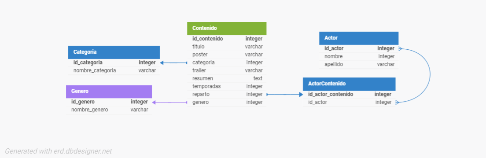

# TrailerFlix: Trabajo Integrador

## Modelo EMR:


## Pasos para usar la API:

1. **Descargar de la carpeta `/database` el archivo `Trailerflix.sql` del repositorio.**
2. **Abrir MySQL Workbench** y ejecutar las cláusulas del archivo `Trailerflix.sql` para crear y poblar la base de datos.
3. **Clonar el repositorio** en tu computadora local usando el comando:
   ```bash
   git clone https://github.com/EnzoFiglioliTrabajo-Integrador-Relacional-Backend-Diplomatura-UNTREF.git

4. **Abrir el proyecto** en tu IDE de preferencia.
5. **Instalar las dependencias** necesarias ejecutando el siguiente comando en la terminal:
   ```bash
   npm install
6. **Ejecutar el servidor** con el comando:
   ```bash
   npm run start
```
## Notas adicionales:
- Asegúrate de tener la base de datos en funcionamiento antes de iniciar el servidor.
- Verifica las configuraciones de conexión en `./conexion/database.js` y cambia el nombre de `.env copy` a `.env` junto a las configuraciones de tu dispositivo para que coincidan con tu entorno local.

- Podes visitar la documentacion con los endpoints en: http://localhost:8080/docs